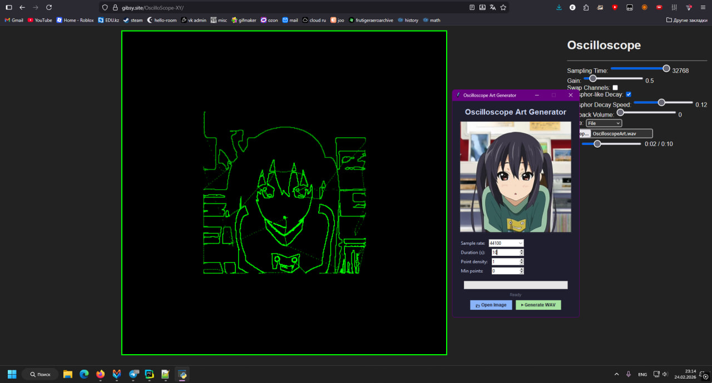

# Oscilloscope Art Generator

Converts a black-on-white image into a WAV file that draws the image on an oscilloscope in X-Y mode.

## Example


## Usage

```bash
pip install -r requirements.txt
python OscilloScopeArt.py
```

1. Click **Open Image** — load a black-on-white PNG/JPG
2. Adjust settings if needed
3. Click **Generate WAV**
4. Open the WAV in your oscilloscope viewer in **X-Y mode**
   (make sure that you enable sound in your tab)

> Test online: [gibsy.site/OscilloScope-XY](https://gibsy.site/OscilloScope-XY)

## Settings

| Setting | Description |
|---|---|
| Sample rate | Audio sample rate (44100 recommended) |
| Duration | Length of the output WAV in seconds |
| Point density | Contour subsampling (1 = max details) |
| Min points | Minimum contour length, filters out noise (0 = max details) |
